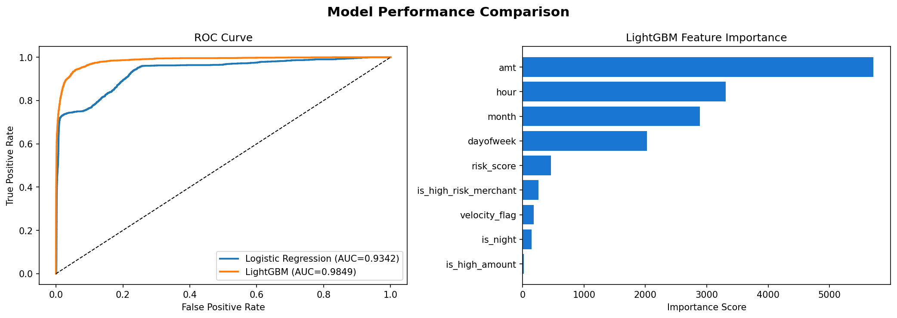
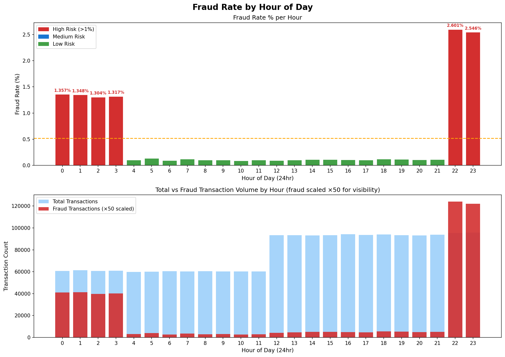
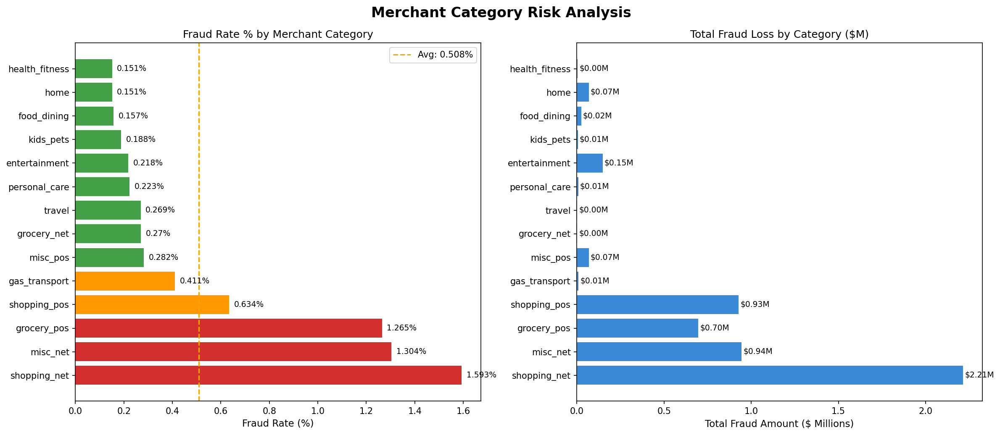
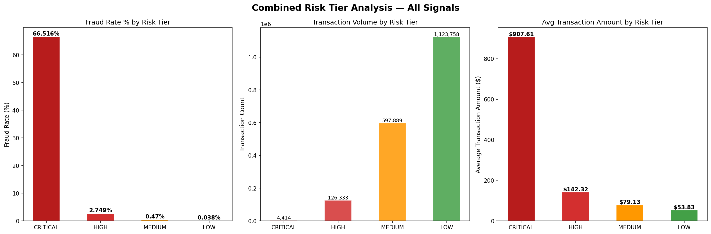

# 🛡️ Credit Card Fraud Risk Analyzer

End-to-end fraud detection system analyzing **1.85M credit card transactions** using a SQL rule engine combined with a LightGBM machine learning model. Built as a portfolio project targeting Credit & Fraud Risk analytics roles.

[](https://credit-risk-analyzer-website.streamlit.app/)


---

## Key Results

| Analysis | Finding | Business Impact |
|----------|---------|----------------|
| Time-based SQL rule | Fraud 25x higher 10pm–3am | Flags 58.9% of fraud with 1 rule |
| Merchant category SQL | 3 categories = 58% of fraud | $3.85M fraud loss concentrated |
| Velocity SQL rule | 5+ txns/hr = 37x fraud risk | 15.93% fraud rate in HIGH VELOCITY |
| Combined risk tier | CRITICAL tier = 66.5% fraud rate | 1,750x safer than LOW tier baseline |
| LightGBM model | ROC-AUC 0.9849 | 70% fewer false positives vs Logistic Regression |

---

## Project Structure

```
credit-risk-analyzer/
├── data/
│   ├── creditcard.csv                # Kaggle PCA dataset (284K rows)
│   ├── fraudTrain.csv                # Simulated transactions train (1.29M rows)
│   ├── fraudTest.csv                 # Simulated transactions test (555K rows)
│   ├── processed_data.csv            # Feature engineered dataset
│   └── risk_scores_full.csv          # Final ML scored output (1.85M rows)
├── sql/
│   ├── 01_schema.sql                 # Table structure and class imbalance
│   ├── 02_fraud_rate_by_hour.sql     # Hourly fraud pattern analysis
│   ├── 03_merchant_risk.sql          # Merchant category risk and loss
│   ├── 04_velocity_checks.sql        # Velocity-based fraud detection
│   └── 05_high_risk_profiles.sql     # 4-signal composite risk scoring
├── notebooks/
│   ├── 00_data_exploration.ipynb     # Initial data reconnaissance
│   ├── 01_eda.ipynb                  # Exploratory data analysis + charts
│   ├── 02_feature_engineering.ipynb  # Feature pipeline + correlation heatmap
│   ├── 03_model_training.ipynb       # LightGBM vs Logistic Regression
│   └── 04_risk_scoring.ipynb         # Risk score generation + validation
├── src/
│   ├── db_setup.py                   # SQLite database creation
│   ├── data_loader.py                # Load data from SQLite
│   ├── preprocessor.py               # Clean and transform data
│   ├── feature_engineer.py           # Velocity + risk features
│   ├── logger.py                     # Logging configuration
│   ├── exception.py                  # Custom exception handler
│   └── utils.py                      # Shared helper functions
├── dashboard/
│   ├── app.py                        # Full local Streamlit app (uses SQLite + model)
│   └── app_cloud.py                  # Cloud deployment version (no file deps)
├── models/
│   ├── lgbm_model.pkl                # Trained LightGBM model
│   └── scaler.pkl                    # StandardScaler for Logistic Regression
├── reports/
│   ├── business_narrative.md         # 1-page business impact analysis
│   ├── 01_class_imbalance.png
│   ├── 01_amount_distribution.png
│   ├── 02_feature_correlation.png
│   ├── 02_fraud_rate_by_hour.png
│   ├── 03_merchant_risk.png
│   ├── 03_model_performance.png
│   ├── 03_confusion_matrix.png
│   ├── 04_velocity_checks.png
│   ├── 04_risk_scoring.png
│   └── 05_high_risk_profiles.png
├── setup.py
├── requirements.txt
└── README.md
```

---

## Setup & Run

```bash
# 1. Clone repository
git clone https://github.com/harshnimsatkar/credit-risk-analyzer.git
cd credit-risk-analyzer

# 2. Create conda environment
conda create -n credit python=3.11
conda activate credit

# 3. Install dependencies
pip install -r requirements.txt

# 4. Download datasets from Kaggle and place in data/ folder
#    Dataset 1: https://www.kaggle.com/datasets/mlg-ulb/creditcardfraud
#    Dataset 2: https://www.kaggle.com/datasets/kartik2112/fraud-detection

# 5. Setup SQLite database
python src/db_setup.py

# 6. Run full local dashboard
streamlit run dashboard/app.py
```

---

## SQL Analysis (5 Query Files)

All SQL logic lives in `sql/` — notebooks read and visualize results.

| File | Query | Key Output |
|------|-------|-----------|
| `01_schema.sql` | Table structure, class splits, amount stats | 1.85M rows, 0.521% fraud rate |
| `02_fraud_rate_by_hour.sql` | Fraud % per hour of day | 10pm = 2.6%, 10am = 0.086% |
| `03_merchant_risk.sql` | Fraud rate + loss per category | shopping_net = 1.593%, $2.21M loss |
| `04_velocity_checks.sql` | LAG window — 5 txns in 60 min | HIGH VELOCITY = 15.93% fraud |
| `05_high_risk_profiles.sql` | 4-signal composite risk tier | CRITICAL = 66.5% fraud rate |

---

## ML Pipeline

```
Raw CSV → SQLite DB → Feature Engineering → Model Training → Risk Score (0–100) → Dashboard
```

**Features engineered:**

| Feature | Description |
|---------|-------------|
| `hour`, `dayofweek`, `month` | Time-based features from transaction timestamp |
| `is_night` | 1 if transaction between 10pm–3am |
| `is_high_risk_merchant` | 1 if category in top 3 fraud categories |
| `is_high_amount` | 1 if amount > $500 (avg fraud amount) |
| `velocity_flag` | 0/1/2 based on txns per 60-min window |
| `risk_score` | Sum of above binary flags (0–4) |

**Model comparison:**

| Model | ROC-AUC | Fraud Caught | False Positives | Accuracy |
|-------|---------|-------------|----------------|---------|
| Logistic Regression | 0.9342 | 1,593 | 54,386 | 85% |
| **LightGBM** | **0.9849** | **1,769** | **16,139** | **96%** |

LightGBM caught **176 more fraud cases** and produced **70% fewer false positives** — meaning 38,247 fewer legitimate customers incorrectly blocked.

---

## Risk Tier Engine

Each transaction is scored across 4 rule-based signals:

| Signal | Condition | Points |
|--------|-----------|--------|
| Night hour | Transaction between 10pm–3am | +1 |
| High risk merchant | shopping_net / misc_net / grocery_pos | +1 |
| High velocity | 5+ transactions within 60 minutes | +1 |
| High amount | Transaction amount > $500 | +1 |

**Risk tiers from combined score:**

| Tier | Signals | Transactions | Fraud Rate | Avg Amount | Action |
|------|---------|-------------|-----------|------------|--------|
| CRITICAL | 3–4 | 4,414 | **66.5%** | $907.61 | Block |
| HIGH | 2 | 126,333 | 2.75% | $142.32 | Step-up auth |
| MEDIUM | 1 | 597,889 | 0.47% | $79.13 | Monitor |
| LOW | 0 | 1,123,758 | 0.038% | $53.83 | Pass through |

> CRITICAL tier is **1,750x more likely** to be fraudulent than LOW tier.

---

## Dashboard Pages

| Page | Description |
|------|-------------|
| Overview | KPIs, model comparison, risk tier distribution |
| Time Analysis | Hourly fraud heatmap with business metrics |
| Merchant Risk | Category fraud rates, loss analysis, full table |
| Velocity Analysis | Transaction speed risk breakdown |
| Risk Tiers | Combined signal analysis + action recommendations |
| Live Risk Scorer | Enter transaction → instant fraud score + gauge chart |

---

## Dashboard Screenshots

| Overview | Time Analysis |
|----------|--------------|
|  |  |

| Merchant Risk | Risk Tiers |
|--------------|-----------|
|  |  |

---

## Business Narrative

See [`reports/business_narrative.md`](reports/business_narrative.md) for full analysis.

**Summary:** Applying the 3-layer rule engine (time + merchant + velocity) with LightGBM scoring:
- Catches **2,936 CRITICAL fraud cases** reviewing only 0.24% of total volume
- Achieves **66.5% precision** on CRITICAL tier — 2 in 3 flagged transactions are genuine fraud
- Protects an estimated **$4.86M in fraud losses**
- Reduces false positives by **70%** vs baseline — minimal friction for legitimate customers

---

## Tech Stack

| Category | Tools |
|----------|-------|
| Language | Python 3.11, SQL |
| ML | LightGBM, Scikit-learn, XGBoost |
| Data | Pandas, NumPy, SQLite |
| Visualization | Matplotlib, Seaborn, Plotly |
| Dashboard | Streamlit |
| Dev Tools | Jupyter, Git, VS Code |
| Cloud | Streamlit Cloud |

---

## Datasets

| Dataset | Source | Rows | Use |
|---------|--------|------|-----|
| Credit Card Fraud Detection | [Kaggle - ULB](https://www.kaggle.com/datasets/mlg-ulb/creditcardfraud) | 284,807 | Model training (V1–V28 PCA features) |
| Credit Card Transactions Fraud | [Kaggle - kartik2112](https://www.kaggle.com/datasets/kartik2112/fraud-detection) | 1,852,394 | SQL analysis (merchant, category, location) |

---

## Author

**Harsh Nimsatkar**  

[](https://github.com/harshnimsatkar)
[](https://linkedin.com/in/harshnimsatkar)
[](mailto:nimsatkarharsh@gmail.com)
